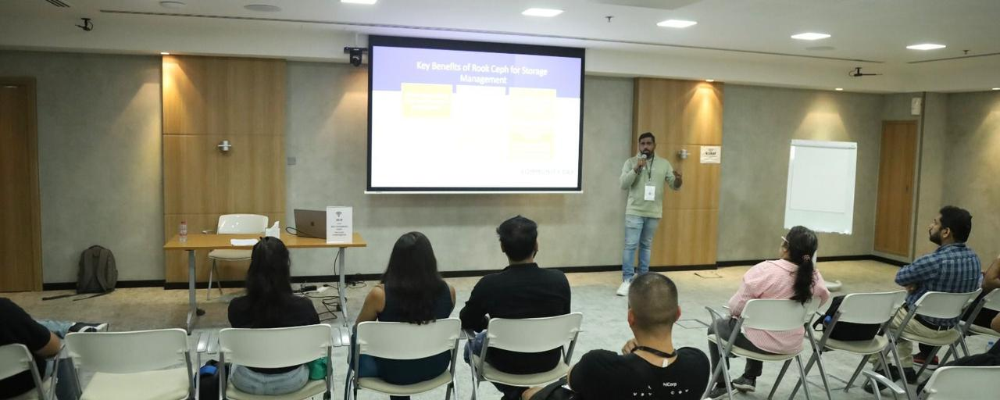

# Rahul Raj VALIA VEETIL
# DevOps and Cloud Architect | CNCG RIYADH & TRIVANDRUM LEAD ORGANISER | Community Builder | Speaker | Content Creator | Blogger | Mentor

Hi there 👋, I'm Rahul Raj V V, a DevOps and Azure Certified Solutions Architect, Speaker, and Mentor. I specialize in architecting, building, and delivering highly resilient, scalable, and distributed technology platforms with a cloud-first and agile mentality. My approach is strongly centered around customer-centricity and business-focused solution development. Over the years, I've demonstrated expertise in solution architecture and building full IT lifecycle solutions in a diverse set of industry verticals.

## About Me

- 🔭 I’m currently working on architecting a large-scale microservices architecture for a financial services company.
- 🌱 I’m currently leading two major CNCF communities CNCG Riyadh,Saudi Arabia and Trivandrum,India
- 👯 I’m looking to collaborate on open-source DevOps projects that improve developer productivity.
- 🤔 I’m looking for help with optimizing CI/CD pipelines for Kubernetes deployments.
- 💬 Ask me about DevOps best practices, cloud architecture, or containerization strategies.Cloud Native tools
- 📫 How to reach me: You can connect with me on [LinkedIn](https://www.linkedin.com/in/rahulrajvv/).
- 😄 Pronouns: He/Him
- ⚡ Fun fact: I love traveling the world and enjoy the sceneries.


## Skills

Here's a glimpse of the skills and technologies I bring to the table:

| CI/CD               | Cloud Platforms | Cloud Automation |
|---------------------|-----------------|------------------|
| Azure DevOps        | Azure           | Terraform        |
| Jenkins             | AWS             | Packer           |
| TeamCity            | GCP             | ARM Template     |
| Gitlab              |                 |                  |
| Ansible             |                 |                  |
| Tekton              |                 |                  |

| Build Tools | Code Analysis & Security | Containerization |
|-------------|---------------------------|------------------|
| Maven       | SonarQube                 | Docker           |
| Gradle      | Veracode                  | AKS (Azure Kubernetes Service) |
| ANT         | White Source              | ACR (Azure Container Registry) |
| Packer      | Aquasec                   | Kubernetes       |
| Cake        | Checkmarx                 | Open Shift       |
| MS Build    |                           | Quay             |
| Pybuild     |                           | Helm             |
|             |                           | ECS (Amazon Elastic Container Service) |
|             |                           | ECR (Amazon Elastic Container Registry) |
|             |                           | Serverless containers |
|             |                           | Azure Webapps    |
|             |                           | Azure Container Instances |

| Monitoring           | Scripting | Packaging and Repository Management |
|----------------------|-----------|-------------------------------------|
| Application Insights  | PowerShell| Nuget                              |
| Log Analytics         | Bash      | NPM                                |
| Grafana               | CMD       | Artifactory feed                   |
| ELK Stack (Elasticsearch, Logstash, Kibana) |         | Helm              |
| GCP APIGEE            |           | ACR (Azure Container Registry)     |
|                      |           | ECR (Amazon Elastic Container Registry) |
|                      |           | Rook Ceph                          |
|                      |           | Longhorn                           |
|                      |           | Harbor                             |


#  Here's a sneak peek of my offline events:

<div align="center">
  <h2>Image Gallery</h2>
</div>
<div align="center">
  <h3>Sep 19 , 2024 - Open Source Summit & CDF Summit Europe,Vienna,Austria  2024<h3>
  
     
  
          
</div>
<div align="center">
  <h3>Sep 25 , 2024 - DevOps Days, Cairo,Egypt 2024<h3>
        
</div>
<div align="center">
  <h3>Sep 19 , 2024 - Open Source Summit & CDF Summit Europe,Vienna,Austria  2024<h3>
  
     
  
      
     
           
</div>

<div align="center">
  <h3>June 08, 2024 - CNCG Trivandrum Kube Bday Bash, Trivandrum, India 2024<h3>
  
  
  
  
</div>

<div align="center">
  <h3>June 05, 2024 - CNCG Riyadh Kube Bday Bash, Saudi Arabia 2024<h3>
  
  
      
      
</div>
<div align="center">
  <h3>March 19, 2024 - Cloud Native Con Paris, France 2024<h3>
  
  
  
  
  
  
  
    
    
</div>
<div align="center">
  <h3>December 15, 2023 - Harbor, Cloud Native Trivandrum, India  2023<h3>
  
</div>
<div align="center">
  <h3>August 23, 2023 - Xebia Agile Meetup Riyadh, Saudi Arabia  2023<h3>
  
  
</div>

<div align="center">
  <h3>April 1, 2023 - DevOn-meetup Bengaluru, Karnataka, India</h3>
  
  
</div>
<div align="center">
<div align="center">
 <h3> March 25, 2023 - DM Meeup Organiser and Speaker, Trivandrum, Kerala</h3>
   
   
   
   

</div>  
 <h3>November 6, 2022 - Prathidwani Technopark, Trivandrum, Kerala</h3>
   
   
   
   
</div>
<div align="center">
 <h3> June 27, 2023 - Harnessing the power of SonarQube with Azure DevOps, Trivandrum, Kerala</h3>
   
</div>
<div align="center">
 <h3> Sep 29, 2022 - DevOps Malayalam Series- AKS Zero to Hero, Trivandrum, Kerala</h3>
   
</div>
<div align="center">
 <h3> Oct 24, 2022 - Integrating Selenium with Azure DevOps, Trivandrum, Kerala</h3>
   
</div>
<div align="center">
 <h3> Oct 29, 2022 - AWS Meetup Kochi 2022, Kerala</h3>

   
   
   
</div>
<div align="center">
 <h3> Oct 21, 2022 - Az Conf Meetup, Chennai, Tamil Nadu</h3>
   
   
   
</div>   

#  Let's build robust and scalable solutions together! 👨‍💻🚀
```
