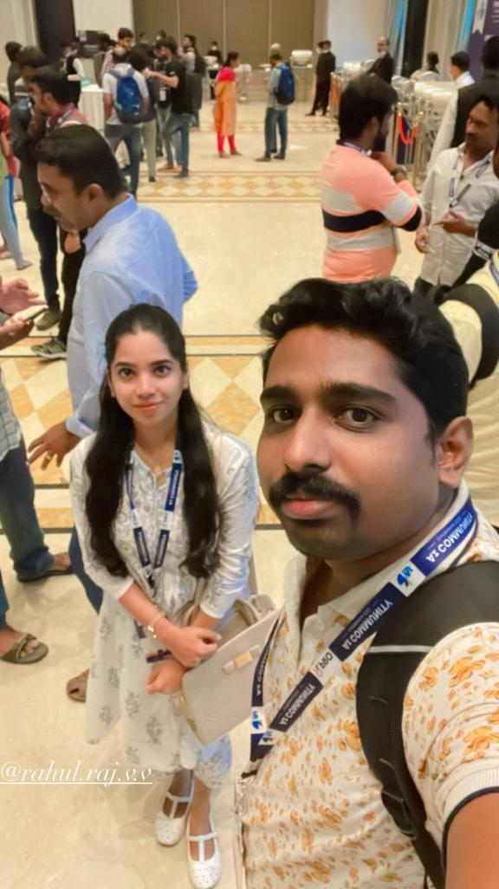

# Rahul Raj V V - DevOps and Azure Certified Solutions Architect

Hi there 👋, I'm Rahul Raj V V, a DevOps and Azure Certified Solutions Architect, Speaker, and Mentor. I specialize in architecting, building, and delivering highly resilient, scalable, and distributed technology platforms with a cloud-first and agile mentality. My approach is strongly centered around customer-centricity and business-focused solution development. Over the years, I've demonstrated expertise in solution architecture and building full IT lifecycle solutions in a diverse set of industry verticals.

## Skills

Here's a glimpse of the skills and technologies I bring to the table:

### CI/CD
- Azure DevOps
- Jenkins
- TeamCity
- Gitlab
- Ansible

### Source Code Management (SCM)
- GIT
- SVN
- ClearCase

### Cloud Platforms
- Azure
- AWS
- GCP

### Cloud Automation
- Terraform
- Packer
- ARM Template

### Build Tools
- Maven
- Gradle
- ANT
- Packer
- Cake
- MS Build
- Pybuild

### Code Analysis & Security
- SonarQube
- Veracode
- White Source
- Aquasec
- Checkmarx 

### Containerization
- Docker
- AKS (Azure Kubernetes Service)
- ACR (Azure Container Registry)
- Kubernetes
- Open Shift
- Quay
- Helm
- ECS (Amazon Elastic Container Service)
- ECR (Amazon Elastic Container Registry)
- Serverless containers
- Azure Webapps
- Azure Container Instances

### Monitoring
- Application Insights
- Log Analytics
- Grafana
- ELK Stack (Elasticsearch, Logstash, Kibana)
- GCP APIGEE

### Scripting
- PowerShell
- Bash
- CMD

### Packaging and Repository Management
- Nuget
- NPM
- Artifactory feed
- Helm
- ACR (Azure Container Registry)
- ECR (Amazon Elastic Container Registry)

## About Me

- 🔭 I’m currently working on architecting a large-scale microservices architecture for a financial services company.
- 🌱 I’m currently learning more about machine learning and its applications in DevOps.
- 👯 I’m looking to collaborate on open-source DevOps projects that improve developer productivity.
- 🤔 I’m looking for help with optimizing CI/CD pipelines for Kubernetes deployments.
- 💬 Ask me about DevOps best practices, cloud architecture, or containerization strategies.
- 📫 How to reach me: You can connect with me on [LinkedIn](https://www.linkedin.com/in/rahulrajvv/).
- 😄 Pronouns: He/Him
- ⚡ Fun fact: I love traveling the world and enjoy the sceneries.

#  Here's a sneak peek of my offline events:

<div align="center">
  <h2>Image Gallery</h2>
</div>

<div align="center">
  <h3>August 23, 2023 - Xebia Agile Meetup Riyadh, Saudi Arabia  2023<h3>
  
  
</div>

<div align="center">
  <h3>April 1, 2023 - DevOn-meetup Bengaluru, Karnataka, India</h3>
  
  
</div>
<div align="center">
<div align="center">
 <h3> March 25, 2023 - DM Meeup Organiser and Speaker, Trivandrum, Kerala</h3>
   
   
   
   

</div>  
 <h3>November 6, 2022 - Prathidwani Technopark, Trivandrum, Kerala</h3>
   
   
   
   
</div>
<div align="center">
 <h3> June 27, 2023 - Harnessing the power of SonarQube with Azure DevOps, Trivandrum, Kerala</h3>
   
</div>
<div align="center">
 <h3> Sep 29, 2022 - DevOps Malayalam Series- AKS Zero to Hero, Trivandrum, Kerala</h3>
   
</div>
<div align="center">
 <h3> Oct 24, 2022 - Integrating Selenium with Azure DevOps, Trivandrum, Kerala</h3>
   
</div>
<div align="center">
 <h3> Oct 29, 2022 - AWS Meetup Kochi 2022, Kerala</h3>

   
   
   
</div>
<div align="center">
 <h3> Oct 21, 2022 - Az Conf Meetup, Chennai, Tamil Nadu</h3>
   
   
   
</div>   

#  Let's build robust and scalable solutions together! 👨‍💻🚀
```
